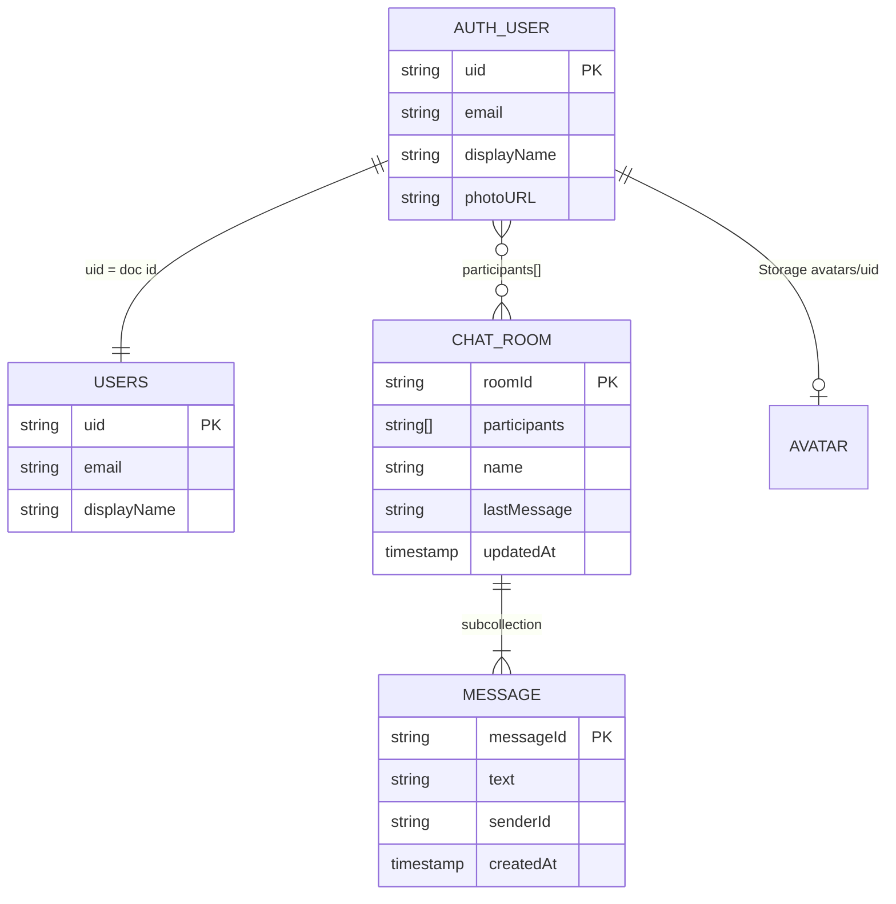

# Firestore & Storage Schema

Canonical data model. App reads and writes must match this document.

---

## Overview

```
Firebase Auth (email/password)
        │
        ▼
┌─────────────────────────────────────────────────────────┐
│  Firestore                                              │
│  ├── users/{uid}                                        │
│  └── chatRooms/{roomId}                                 │
│       └── messages/{messageId}                          │
└─────────────────────────────────────────────────────────┘
        │
        ▼
┌─────────────────────────────────────────────────────────┐
│  Storage                                                │
│  └── avatars/{uid}   (profile photo, one file per user) │
└─────────────────────────────────────────────────────────┘
```

---

## Collections

### `users/{uid}`

Directory of registered users. Document ID **must** equal Firebase Auth `uid`.

| Field | Type | Required | Written by | Notes |
|-------|------|----------|------------|-------|
| `email` | `string` | yes | `app/login.tsx` on sign-in/sign-up | From Auth user |
| `displayName` | `string \| null` | no | `app/login.tsx`, `app/profile/index.tsx` | Shown in Contacts |
| `photoURL` | `string \| null` | no | `app/profile/index.tsx` | Avatar in Contacts when set |
| `username` | `string \| null` | no | `app/profile/index.tsx` | Handle shown as `@username` |
| `bio` | `string \| null` | no | `app/profile/index.tsx` | Profile bio |
| `location` | `string \| null` | no | `app/profile/index.tsx` | Profile location |
| `phone` | `string \| null` | no | `app/profile/index.tsx` | Profile phone (not Auth phone verify) |
| `updatedAt` | `timestamp` | no | `lib/users.ts` `syncUserDoc` | Last profile sync |

---

### `chatRooms/{roomId}`

One document per conversation. Currently **1:1 only** (exactly 2 participants).

| Field | Type | Required | Written by | Notes |
|-------|------|----------|------------|-------|
| `participants` | `string[]` | yes | `app/(tabs)/explore.tsx` on create | Exactly two distinct Auth UIDs; **immutable** after create |
| `name` | `string` | no | `app/chat/[id].tsx` rename | Defaults to `"Chat"` in UI if missing; max 256 chars |
| `lastMessage` | `string` | no | `app/chat/[id].tsx` on send | Preview text on home list; max 1000 chars |
| `updatedAt` | `timestamp` | yes | create + each message | `serverTimestamp()`; used for home sort |

**Reads:**

- `app/(tabs)/index.tsx` — rooms where `participants array-contains currentUid`, `orderBy updatedAt desc`
- `app/(tabs)/explore.tsx` — find existing DM with selected user
- `app/chat/[id].tsx` — room metadata (name)

**Required composite index:** `participants` (ARRAY) + `updatedAt` (DESC)

Defined in [`firebase/firestore.indexes.json`](../firebase/firestore.indexes.json). Deploy with `yarn deploy:rules`.

---

### `chatRooms/{roomId}/messages/{messageId}`

Subcollection of messages. Ordered by `createdAt`.

| Field | Type | Required | Written by | Notes |
|-------|------|----------|------------|-------|
| `text` | `string` | yes | `app/chat/[id].tsx` on send | 1–1000 chars (client and rules) |
| `senderId` | `string` | yes | `app/chat/[id].tsx` | Must equal the Auth UID of the writer |
| `createdAt` | `timestamp` | yes | `serverTimestamp()` on send | Used for message ordering; must be a server timestamp |

**Reads:** `app/chat/[id].tsx` — `orderBy createdAt desc`, rendered inverted.

**Not implemented:** `imageUrl`, `readBy`, `editedAt`, reactions.

---

## Storage paths

### `avatars/{uid}`

| Property | Value |
|----------|-------|
| Path | `avatars/{uid}` |
| Written by | `app/profile/index.tsx` |
| Format | Image blob from device library |
| Auth mirror | `photoURL` on Firebase Auth user via `updateProfile` |

---

## Security rules (reference)

Source of truth in repo:

- [`firebase/firestore.rules`](../firebase/firestore.rules)
- [`firebase/storage.rules`](../firebase/storage.rules)

Deploy them with `yarn deploy:rules` (see [`docs/SETUP.md`](./SETUP.md)).

Firestore rules enforce:

- **Messages:** `senderId == request.auth.uid`; only `text`, `senderId`, and `createdAt` may be written; no updates or deletes.
- **Rooms:** create requires exactly two distinct existing users, including the creator. After create, `participants` cannot change. Updates may touch only `name`, `lastMessage`, and `updatedAt`.

---

## Query reference

| Screen | Query |
|--------|-------|
| Home | `chatRooms` where `participants array-contains uid` orderBy `updatedAt` desc |
| Contacts | `users` get all docs, filter out self client-side |
| Start chat | `chatRooms` where `participants array-contains uid`, then filter for other user |
| Chat | `chatRooms/{id}/messages` orderBy `createdAt` desc |

---

## Entity relationships


